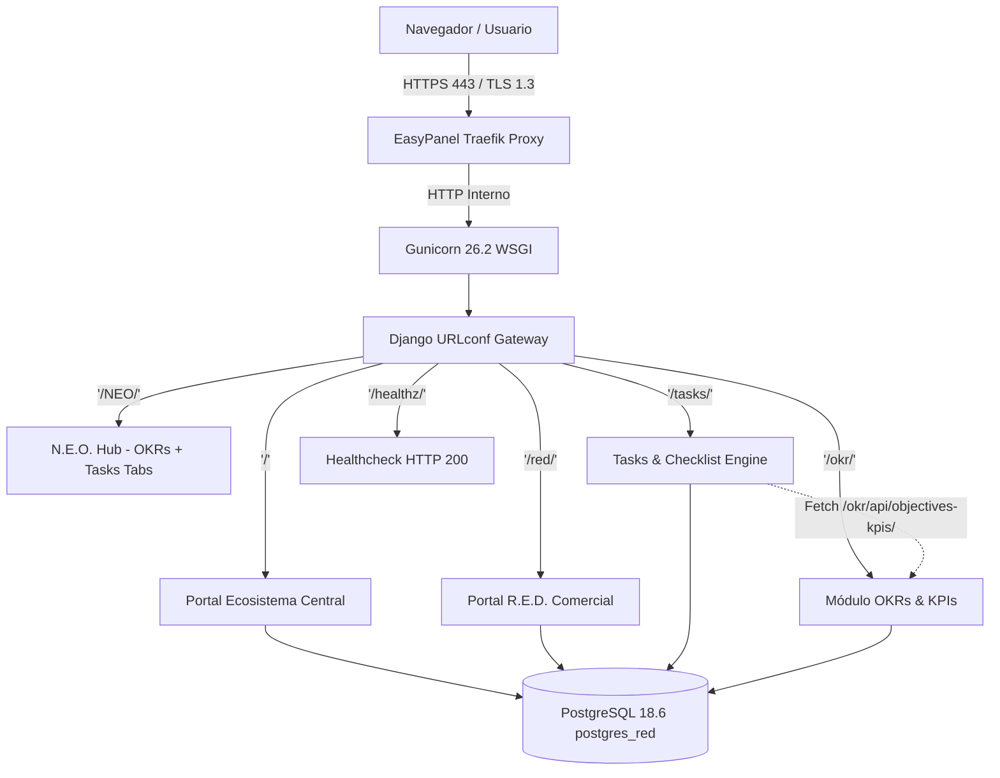

# CNTXT® — Ecosistema Empresarial Central (2026)
## Arquitectura de Software, Módulos Unificados y Guía Operativa de Mantenimiento

> **Dominio Central:** [https://centralcntxt.tech](https://centralcntxt.tech)  
> **Servidor VPS:** `2.25.68.160` (Hostinger Ubuntu 24.04 LTS / EasyPanel / Traefik / Docker)  
> **Base de Datos:** PostgreSQL 18.6 (Contenedor `postgres_red`, Puerto 5432)  
> **Repositorio Monorepo:** [https://github.com/cont3xto-ceoscl/cntxt-red](https://github.com/cont3xto-ceoscl/cntxt-red) (`main`)  
> **Punto de Restauración Estable:** Git Tag `v1.0.0-stable-pre-neo`

---

## 1. Directorio del Ecosistema y Accesos en Producción

| Módulo / Sección | URL de Producción | Tipo de Acceso | Descripción Operativa |
| :--- | :--- | :--- | :--- |
| **Portal Ecosistema Central** | [`https://centralcntxt.tech/`](https://centralcntxt.tech/) | Público / Navegación | Landing maestro del ecosistema con accesos directos a N.E.O., R.E.D. y Tasks. |
| **N.E.O. Hub Unificado** | [`https://centralcntxt.tech/NEO/`](https://centralcntxt.tech/NEO/) | Hub Estratégico (Tabs) | Núcleo Estratégico Organizacional: pestañas interactivas para OKRs & KPIs y Tasks & Ejecución. |
| **Portal R.E.D.** | [`https://centralcntxt.tech/red/`](https://centralcntxt.tech/red/) | Comercial / CRM | Sistema de Relaciones Estratégicas y Dinámica Comercial (glóbulos rojos, embudos B2B/B2C/SELECT). |
| **Tasks & Checklist Engine** | [`https://centralcntxt.tech/tasks/`](https://centralcntxt.tech/tasks/) | Operación Diaria | Gestor de tareas con Matriz Eisenhower de 4 cuadrantes, calendario colombiano y conexión a OKRs. |
| **API OKRs & KPIs en Vivo** | [`https://centralcntxt.tech/okr/api/objectives-kpis/?line=neo`](https://centralcntxt.tech/okr/api/objectives-kpis/?line=neo) | REST API JSON | Alimenta dinámicamente el selector de tareas con los Objetivos y KPIs del ciclo activo de N.E.O. |
| **Seguimiento OKRs** | [`https://centralcntxt.tech/okr/`](https://centralcntxt.tech/okr/) | Módulo Estratégico | Tableros de control trimestrales, líneas de negocio, Key Results y semáforos de confianza ejecutiva. |
| **Login Institucional OKRs** | [`https://centralcntxt.tech/login/`](https://centralcntxt.tech/login/) | Autenticación Django | Pantalla de inicio de sesión segura para directivos y coordinadores de área. |
| **Django Admin Maestro** | [`https://centralcntxt.tech/admin/`](https://centralcntxt.tech/admin/) | Administración Central | Gestión de usuarios, contactos, empresas, proyectos, checklist y tablas de OKR. |
| **Healthcheck & Uptime** | [`https://centralcntxt.tech/healthz/`](https://centralcntxt.tech/healthz/) | HTTP 200 OK | Endpoint liviano sin consumo de base de datos para monitoreo de uptime continuo. |

---

## 2. Arquitectura de Software del Monorepo



### Capas Principales:
1. **Frontend Router & Gateway:** `EcosystemPortalView` y `NeoUnifiedView` con `X_FRAME_OPTIONS = 'SAMEORIGIN'` para incrustación segura.
2. **Tasks & Checklist Engine:** Almacena tareas en `ChecklistProject.tasks` (JSONField) preservando `okrObjectiveCode`, `okrObjectiveId`, `okrKpiId`, `okrKpiCode`.
3. **Módulo de OKRs:** Modelos `Cycle`, `Line`, `LineCyclePlan`, `Objective`, `KeyResult`, `Kpi`, `ActionItem`, `CheckIn`.
4. **Capa de Persistencia:** PostgreSQL 18.6 con migraciones automáticas no destructivas en `docker-entrypoint.sh`.

---

## 3. Modelo de Integración OKRs <--> Tasks (Anti-Tareitis)

```
[ Usuario abre modal de Tarea en Tasks ]
                   │
                   ▼
[ Consulta asíncrona a /okr/api/objectives-kpis/?line=neo ]
                   │
                   ▼
[ Selector se puebla con: ]
  ├── Optgroup: [O.T.1] Título del Objetivo Estratégico
  │     ├── Opción General: 🎯 [O.T.1] Objetivo General
  │     └── Opciones de KPIs: 📊 [KPI-NEO-01] Nombre del KPI (Meta: XX%)
  └── Alerta de Tareitis si queda vacío: ⚠️ Invita a descartar o delegar
                   │
                   ▼
[ Guardado de Tarea ] ──> Persiste en PostgreSQL con badge visual en Matriz y Calendario
```

---

## 4. Pilares de Mantenimiento Preventivo

1. **Respaldos de PostgreSQL:**
   - Realizar backup antes de cambios mayores:
     ```bash
     sudo docker exec -t $(sudo docker ps -qf name=postgres_red) pg_dumpall -c -U postgres > backup_$(date +%Y%m%d).sql
     ```
2. **Trazabilidad en GitHub:**
   - Tag de respaldo permanente: `v1.0.0-stable-pre-neo`.
   - Flujo de ramas `feature/*` -> `main`.
3. **Despliegues en EasyPanel:**
   - Push a `main` -> Clic en **Deploy** en `portal_red`.
   - `docker-entrypoint.sh` se encarga de las migraciones, sembrado y estáticos automáticamente.
4. **Monitoreo de Uptime:**
   - Apuntar monitor externo a `https://centralcntxt.tech/healthz/`.

---

## 5. Botiquín de Comandos SSH en Producción

| Objetivo Operativo | Comando SSH |
| :--- | :--- |
| **Conexión SSH** | `ssh root@2.25.68.160` |
| **Ver Contenedores** | `sudo docker ps` |
| **Ver Logs en Tiempo Real** | `sudo docker logs -f $(sudo docker ps -qf name=portal_red)` |
| **Reiniciar Backend** | `sudo docker restart $(sudo docker ps -qf name=portal_red)` |
| **Backup PostgreSQL** | `sudo docker exec -t $(sudo docker ps -qf name=postgres_red) pg_dumpall -c -U postgres > backup.sql` |
| **Re-sembrar Ciclo OKRs** | `sudo docker exec -it $(sudo docker ps -qf name=portal_red) python manage.py seed_q3_2026` |
| **Comprobar Salud** | `curl -I https://centralcntxt.tech/healthz/` |

---

## 6. Metodología para Nuevas Mejoras en 6 Pasos

1. **Especificación:** Definir requerimiento funcional y vistas.
2. **Punto de Respaldo:** Crear rama `feature/nueva-mejora`.
3. **Construcción Local:** Implementar plantillas, vistas y modelos.
4. **Validación Estricta:** Ejecutar `python manage.py check` y pruebas HTTP.
5. **Merge & Push:** Fusionar a `main` y enviar a GitHub.
6. **Deploy en EasyPanel:** Hacer clic en **Deploy** en `http://2.25.68.160:3000`.
